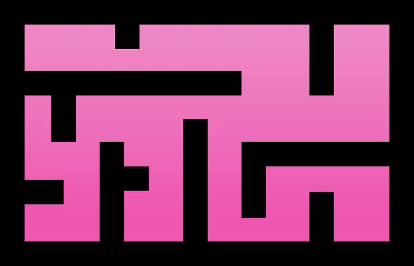
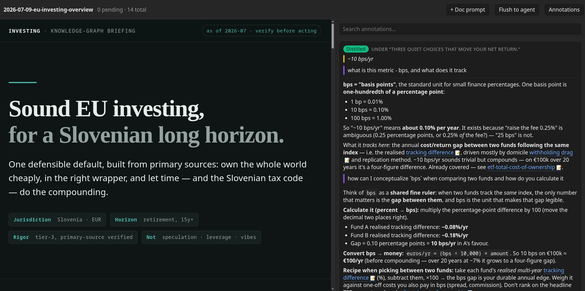
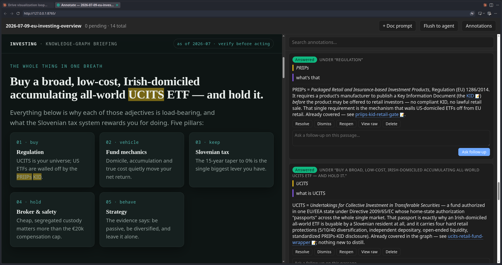
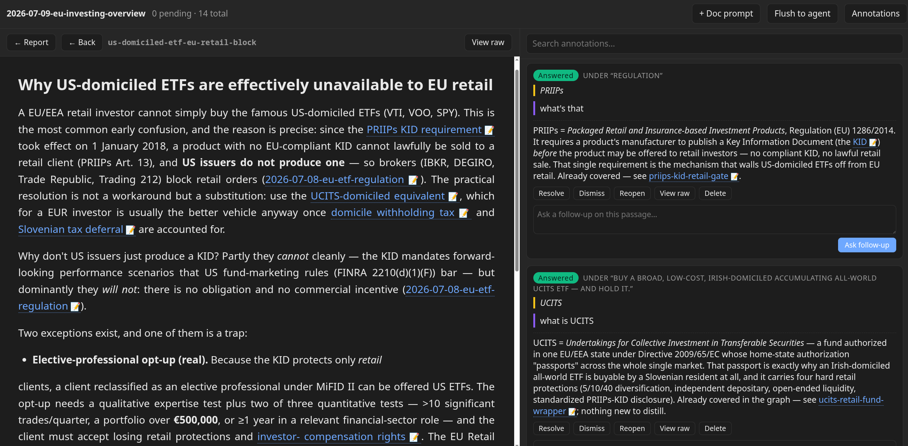

<div align="center">



# mozak

**Agent-maintained, program-agnostic knowledge graphs.**

*Plain Markdown is the single source of truth — every tool is a replaceable lens.*

[](https://github.com/RobertBarachini/mozak/actions/workflows/check.yml)
[](LICENSE)
[](AGENTS.md)
[](AGENTS.md)
[](tools/)

[Hand it over](#-hand-it-to-your-agent) ·
[What this is](#what-this-is) ·
[Orientation](#-orientation) ·
[One loop, end to end](#-one-loop-end-to-end) ·
[Why](#-why)

</div>

---

| | |
|---|---|
| **What** | A research memory your agent keeps for you: plain Markdown notes you own, linked into a graph, readable by any tool. |
| **How** | You don't set it up, your agent does. Paste one block into it (next section) and talk to it two minutes later. |
| **Why** | Notes that outlive every app, an agent that does the upkeep, and a record you can trace claim by claim. |

## 🤝 Hand it to your agent

Copy the block below (the button in its corner) and paste it into any agent that can run
commands — Claude Code, Codex, Cursor, Gemini CLI or another; the block tells it where the
rules live.

```text
Set up a personal knowledge repo for me from the mozak template. Follow these steps
exactly, in order. Ask me before anything that needs my input, and never invent an
answer for me.

1. Clone https://github.com/RobertBarachini/mozak.git into a folder named as I say
   (default: mybrain), then work inside it.
2. Read AGENTS.md (the rules) and SETUP.md (the procedure). They win over this message.
3. Run `python3 tools/bootstrap.py`. It checks the setup and prints what is still
   missing, with the exact command for each item. Do what it says and re-run it until
   it reports ready.
4. Whenever it prints questions, ask me each one with its options explained, then
   record my answer the way it says. That covers the web-acquisition consent and my
   personal context in .personal-shared/ (how to address me, locale, preferences,
   whether this machine is mine) — mine to give, never yours to guess, and every
   answer may be "skip".
5. Rewrite README.md and pages/start-here.md so they describe MY repo from what I
   told you, write the first journals/ entry, run `python3 tools/graph.py check`,
   draft a commit message, and stop. I commit.

Finish by telling me: "Ready. Open <folder> in your agent and ask it to research
something."
```

What happens next: it clones into a folder you name, installs nothing, runs the checks, asks
you a few questions it will never answer for you, and says **Ready**. About two minutes. Then
talk to it, for example:

- *"Research X — capture your sources, distill what matters into the graph."*
- *"Ingest this video / article / PDF: `<url>`."*
- *"Render me a briefing on Y from what the graph knows, and let me annotate it."*

No agent that can run commands yet? Do the first step yourself —
`git clone https://github.com/RobertBarachini/mozak.git mybrain` — then open the folder in one
that can, and paste the block. Clone rather than pressing GitHub's *"Use this template"*
button: it copies files with an unrelated history and no `template` remote, which severs the
ancestry the [SYNC.md](SYNC.md) pull ritual depends on ([SETUP.md](SETUP.md) §1).

## What this is

*Mozak* ("brain") — a **template for agent-maintained, program-agnostic knowledge
graphs**. Plain Markdown is the single source of truth; every tool (Claude Code,
other agents, Obsidian, Logseq, grep) is a replaceable lens. Forward links are
double-bracket wikilinks in note bodies; **backlinks are derived, never stored**
(`python3 tools/graph.py check` materializes `_generated/links.json`; plain grep
works too).

This repo is the **template**: the constitution, schema, note templates, link
tooling, and the meta-domain pages that document the system. Living **instances**
(your actual knowledge bases) are born from it and stay connected — pulling system
updates down and upstreaming generalizable improvements — per the contract in
[SYNC.md](SYNC.md). The by-hand path — clone, attach the template as upstream, smoke-test —
is [SETUP.md](SETUP.md) §1–§3; `python3 tools/bootstrap.py` walks the same steps as a
checklist.

## 🧭 Orientation

| Who | Where |
|---|---|
| 🧑 Humans | [pages/start-here.md](pages/start-here.md) — the root map of content |
| 🤖 Agents | [AGENTS.md](AGENTS.md) — the constitution (Claude Code loads it via [CLAUDE.md](CLAUDE.md)) |
| 🔧 Ops | [SETUP.md](SETUP.md) · [SYNC.md](SYNC.md) · [CHANGELOG.md](CHANGELOG.md) · [ROADMAP.md](ROADMAP.md) |
| 🤔 Why it's shaped this way | the meta pages: design rationale, lineage, research flow |

> Designed 2026-07 from an adversarially-verified deep-research run over the
> agentic-PKM landscape (MCP servers, evergreen notes/Zettelkasten/digital-garden
> methodology, Logseq-vs-Obsidian authoring tradeoffs); the rationale lives in-graph
> under the `meta` domain.

## 🔬 One loop, end to end

What a working session actually looks like. This is a real trace from a private
instance — its first content domain, EU retail investing — generalized per the
[privacy boundary](SYNC.md). Each step links to the page that owns the convention;
this section shows, the meta pages define.

> **The prompt:** *"Research personal investing strategies for individuals in the
> EU — capture your sources, distill what matters into the graph, and render me a
> briefing I can talk back to."*

1. **Scope by stakes.** Before any search, the question is tiered per the
   [search gates](pages/mozak-search-gates.md): this one gates a real financial
   decision → tier 3 (commitment) — full-landscape breadth, adversarial
   verification mandatory.
2. **Gather → capture.** A five-angle sweep (regulation, fund mechanics, local
   tax, brokers, strategy) lands as five `sources/` captures with provenance
   frontmatter — 64 claims extracted, per the
   [ingestion workflow](AGENTS.md#ingestion-workflow-two-pass--never-skip-the-raw-layer).
3. **Adversarial verification.** Every load-bearing claim is independently
   verified (78 verdicts); the highest-stakes angle gets **three lenses per
   claim** — exact statutory figure, recency/reform check, active refutation.
4. **A 2-vs-1 split.** On the single most decision-relevant figure, the lenses
   disagree. Majority vote would be the wrong move: per
   [claim-level provenance](pages/mozak-claim-level-provenance.md) the split triggers an
   adversarial search of *both* sides against primary sources. The dissent is
   refuted — and preserved in the note as negative knowledge, so it is never
   re-litigated.
5. **Distill → link.** Claims passing the
   [admission test](pages/mozak-store-the-delta.md) become 25 atomic notes plus a domain
   MOC, every wikilink stating *why* it exists; the search stops on a recorded
   [convergence gate](pages/mozak-search-gates.md), not on exhaustion, and
   `graph.py check` exits 0.
6. **Synthesize outward.** An HTML briefing is rendered to
   `_generated/presentations/` — disposable by contract
   ([research flow](pages/mozak-research-flow.md)): every insight in it lives in
   `pages/` first, and a render stays local — publishing is a separate,
   explicitly authorized act (AGENTS rule 10).
7. **Re-prompt the render.** `python3 tools/annotate.py <report>` serves the
   briefing with an [annotation overlay](pages/mozak-report-annotation-loop.md):
   highlight a passage, attach a prompt; an event-driven watcher wakes the agent,
   which drains the queue — answers appear in the open page live, and wikilinks
   in answers open the underlying notes in place.
8. **Close the loop.** Of 14 annotations (18 threaded exchanges), most were
   answered by pointing at notes the graph already held — the diagnostic win: no
   gaps. The two that carried a genuine delta were web-verified and distilled
   back (one new note, one amended), their statuses flipping
   `answered → distilled`. Journal entry, final `check`, drafted commit — the
   human reviews and commits.

<div align="center">



<em>The briefing, served by <code>tools/annotate.py</code> with the annotation
drawer open: highlighted passages carry threaded prompts, and status chips
(<code>pending → answered → distilled</code>) flip live as the agent drains the
queue.</em>

<br><br>



<em>All-in-one in the editor: the render is plain self-contained HTML, so the
whole loop — read, highlight, prompt, watch answers land — runs in VS Code's
built-in browser (or anything that can display basic HTML), right next to the
agent draining it.</em>

<br><br>



<em>Answers link back into the graph: click a referenced note and it opens
rendered in-pane (with <code>← Report</code> / <code>← Back</code> navigation and
a raw view), its own wikilinks drill deeper, and any external link opens in a new
tab, ready to investigate — the annotation thread stays alongside the whole
time.</em>

</div>

> [!NOTE]
> The screenshots show a **dated sample from a real run** (rendered 2026-07 — note
> the *"as of 2026-07 · verify before acting"* chip), included to illustrate the
> method, **not as financial advice**. Amounts are illustrative round numbers. The
> graph scopes such claims as time-bound and corrects them in place when the world
> moves (rule 8) — these pixels won't be, so trust the method, verify the facts.

<details>
<summary><strong>A representative exchange from the annotation thread</strong></summary>

> **Prompt:** what is UCITS
>
> **Agent:** UCITS = *Undertakings for Collective Investment in Transferable
> Securities* — a fund authorized in one EU/EEA state whose authorization
> "passports" across the whole single market. The graph already answers this —
> pointed at the existing wrapper note; nothing new to distill.

Most exchanges end exactly like this: the right outcome is usually a pointer into
the graph, not a new note — that's [store the delta](pages/mozak-store-the-delta.md)
working as intended.

</details>

## 🧠 Why

I've always wanted to systematically gather, organize, categorize, and retrieve
knowledge. After years of research, abstraction-building, and trial and error, I
landed on outliner tools - especially Logseq, which kicked off my interest in
outliners, ontology, epistemics, and everything adjacent. The problem I kept
hitting, even while following solid, established frameworks, was **retrieval and
drift**: knowledge went in, but finding it later - and keeping it true - didn't
scale.

From the first LLMs onward I wanted to leverage them for retrieval and for
synthesizing knowledge into actionable insight. I started theorizing about their
potential when OpenAI's early closed programming demos appeared, and first put
them to the test in my
[master's thesis](https://repozitorij.uni-lj.si/IzpisGradiva.php?id=165469&lang=eng) -
mining news coverage of the global chip shortage, iteratively expanding search
terms, and tracking occurrence trends as early-warning signals, with LLMs proposed
as the analysts inside the alert system. But only recently has the ecosystem
matured enough for agents to act as the brain of a full, end-to-end integrated
research system - one that builds and maintains the second brain rather than
merely querying it.

This repository is my current iteration of that attempt: a system for knowledge
synthesis with a thin ontology and thick epistemics - and a meta-tool meant to
evolve into ever more integrated systems for human knowledge augmentation.

---

*Read this far? The next step is the same as the first: [hand it to your agent](#-hand-it-to-your-agent).*
